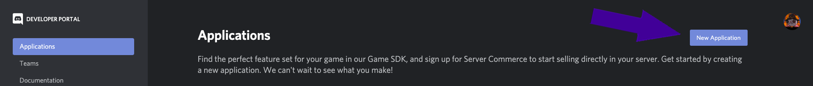

# Make Your Discord Application
Go to the [Discord developers applications page](https://discord.com/developers/applications). You may be prompted to log in with your Discord account. Press the "New Application" button in the top right of the page.

  

Put in the name of your application - this will end up being the default name of your bot but you can change it later. Press the "Create" button.

  

# Save the Client ID
This link - `https://discordapp.com/oauth2/authorize?&client_id={Client ID}&scope=bot&permissions={Permissions Integer}` - is the link used to invite users to your server. Replace `{Client ID}` in this link with the "Client ID" in the center of your page. We will get to `{Permissing Integer}` later.

  

# Add a Bot to Your Application
Go to the "Bot" section by clicking the button on the left side of your page and then clicking the "Add Bot" button. When prompted to see if you are sure, say yes.

  

# Discord Bot Token
Now that you have your bot you can copy its token. You will need this token when setting up your project.

> ⚠️WARNING: Your Discord Token is a sensitive piece of information and exposing it to the public puts your bot at risk of being hacked. Make sure to never share or upload this token.⚠️

  

# Finish Making the Bot Invite URL
We can now get the last piece we need for the bot invite link - `https://discordapp.com/oauth2/authorize?&client_id={Client ID}&scope=bot&permissions={Permissions Integer}`.
You already have `Client ID`, the `Permissions Integer` is how tell Discord what you want to let the bot be able to do. To generate the `Permissions Integer` you can go back to the Bot tab and scroll to the bottom of the page. Selecting options there will generate a new `Permissions Integer` - we recommend starting with "Send Messages" and "Read Message History".

  

Anyone who goes to the link you created will be prompted to add your bot to one of their servers. Go that link so you can add it to a server and use it for testing. Select the server you want to add the bot to and press the "Continue" button.

  

You will be prompted to authorize the bot based on the "Permissions Integer" you set earlier. Once you press the "Authorize" button your bot will be added to your server.

  

# Next
Our project is now set up, let's start the bot - proceed to [Getting Started - Setup Your Workspace](gs_setup_your_workspace).
